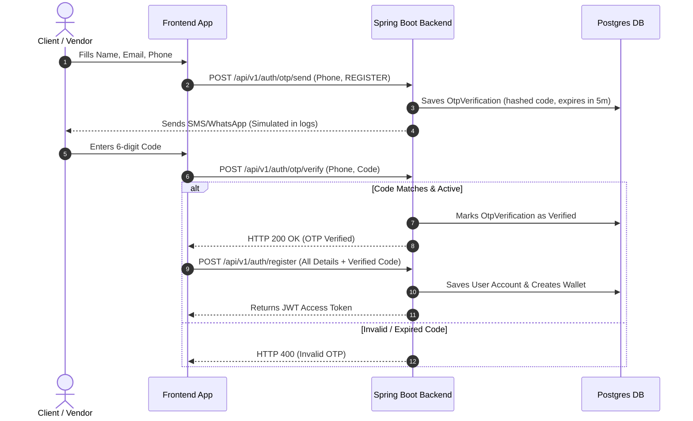

# LocalHub: System Architecture & Design Documentation

LocalHub is a full-stack, hyperlocal service booking marketplace that connects local customers with verified service providers (vendors/partners) based on real-time geocoding proximity.

---

## 1. High-Level System Architecture

LocalHub follows a decoupled, three-tier web application architecture:

```mermaid
graph TD
    classDef client fill:#3b82f6,stroke:#1d4ed8,color:#fff;
    classDef server fill:#a855f7,stroke:#6b21a8,color:#fff;
    classDef database fill:#10b981,stroke:#047857,color:#fff;

    subgraph Client Tier (Frontend React Applications)
        C_App["Customer & Provider Mobile App (Vite React + MUI)"]:::client
        Admin_Dashboard["Admin Dashboard (Vite React + MUI)"]:::client
    end

    subgraph Logic Tier (Spring Boot REST API)
        Gateway["Spring Security Gateway & JWT Auth Filter"]:::server
        Controllers["REST Controllers (Spring MVC)"]:::server
        Services["Core Services (Spring Business Logic)"]:::server
        Repos["Spring Data JPA Repositories"]:::server
    end

    subgraph Data Tier (Relational DB & Cache)
        DB[("Neon/PostgreSQL Database")]:::database
        Cache[("In-Memory Redis Cache")]:::database
    end

    C_App -->|HTTPS / JSON + JWT| Gateway
    Admin_Dashboard -->|HTTPS / JSON + JWT| Gateway
    Gateway --> Controllers
    Controllers --> Services
    Services --> Repos
    Repos --> DB
    Services -->|Cache Keys| Cache
```

---

## 2. Tech Stack Summary

| Layer | Component | Technologies Used |
| :--- | :--- | :--- |
| **Frontend** | Customer & Partner Client | React (Vite, Material-UI, Axios, React Router, React Hook Form) |
| **Frontend** | Management Console | React (Vite, Material-UI, Chart.js for reports) |
| **Backend** | REST API Web Service | Spring Boot 3.x, Java 21, Spring Security (JWT Token Authentication), Spring Data JPA |
| **Database** | Database Engine | PostgreSQL (Production) / H2 In-Memory (Test/Local Profiles) |
| **Database** | Database Migrations | Flyway Migrations |
| **Caching** | Session & Queue Cache | Redis |
| **Hosting** | Web Deployment | Vercel (Frontends) / Render (Backend Web Service) / Neon (Cloud DB) |

---

## 3. Directory & File Structure

```
localhub/
├── docs/                             # Architecture & guides
├── src/                              # Spring Boot Backend Source
│   ├── main/
│   │   ├── java/com/sai/geoLocation/
│   │   │   ├── auth/                 # JWT Auth, OTP, Profile Services & Controllers
│   │   │   ├── business/             # Provider Profile, Document, Location Entities & API
│   │   │   ├── servicebooking/       # Services Catalog, Booking Flow, Status Engine
│   │   │   ├── wallet/               # Wallet Balances, Razorpay Mock Transactions
│   │   │   ├── chat/                 # Customer-Provider Chat Messaging Engine
│   │   │   ├── common/               # Global REST Handlers, DTO Wrappers
│   │   │   └── config/               # Security, OpenAPI, CORS configuration
│   │   └── resources/
│   │       ├── db/migration/         # Flyway Schema & Seed SQL scripts
│   │       └── application.yml       # Dev/Prod DB profiles & secrets
│   └── test/                         # JUnit & Integration Test Suites
├── frontend/                         # Monorepo Frontends
│   ├── mobile-app/                   # Customer Home & Partner Dashboard
│   └── admin-dashboard/              # Admin Platform Approvals & Metrics Panel
└── pom.xml                           # Maven dependencies & build configuration
```

---

## 4. Database Schema (Flyway Entity Relationships)

The Postgres database schema is initialized and maintained via Flyway SQL migration scripts under `src/main/resources/db/migration/`:

* **`users`**: Base login credentials, contact info, and security role mappings (`CUSTOMER` / `SHOP_OWNER` / `ADMIN`).
* **`businesses`**: Linked partner company profiles containing service coordinates, shop name, operational settings, and active checkbook states.
* **`services`**: Operational catalogs offering detailed services (e.g. name, descriptions, duration, pricing lists).
* **`bookings`**: Customer appointments capturing target locations, requested slots, operational statuses, and cost details.
* **`wallets` & `wallet_transactions`**: User accounting balances ensuring zero-loss split fee logic (debits booking values on customer release, credits partner earnings while reserving an 8.5% platform administrative commission fee).
* **`otp_verifications`**: Logins and partner registration security checks mapping generated codes to active phone lines.
* **`chat_messages`**: Secure chat thread lines between active customers and vendors.

---

## 5. Key Feature Workflows

### 5.1. Secure Onboarding with WhatsApp OTP


### 5.2. Hyperlocal Distance Check (Haversine Proximity)
When a customer attempts to book a service:
1. The frontend supplies the customer's coordinates (`lat`, `lng`) captured via browser GPS or pinned on the map.
2. The backend retrieves the coordinates of the provider (`latitude`, `longitude`) and their specified `service_radius_km`.
3. The distance is calculated in Java using the **Haversine Formula**:
   $$d = 2R \arcsin \left( \sqrt{\sin^2\left(\frac{\Delta \text{lat}}{2}\right) + \cos(\text{lat}_1)\cos(\text{lat}_2)\sin^2\left(\frac{\Delta \text{lng}}{2}\right)} \right)$$
4. If $d \le \text{service\_radius\_km}$, the booking is allowed. If $d > \text{service\_radius\_km}$, the transaction is blocked with a validation exception.
