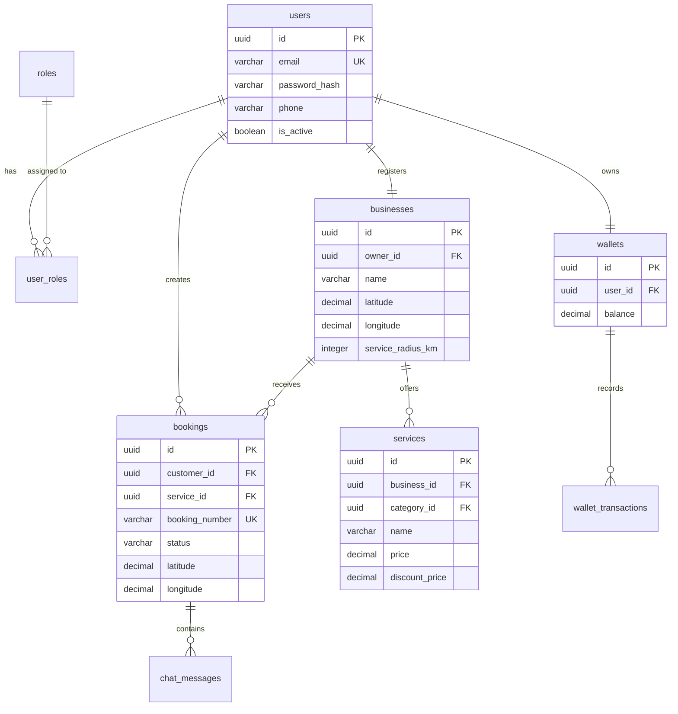

# LocalHub: Database Entity Architecture & Data Model

This document specifies the database entity architecture, schema structures, table constraints, and relational mappings for **LocalHub**.

---

## 1. Entity Relationship Diagram (ERD)

The following Mermaid diagram visualizes the relational links between core database tables:

---

## 2. Global Entity Standards

All model entities extend `BaseEntity.java` to enforce platform-wide auditing standards:
* **UUID Primary Keys:** All tables use globally unique 128-bit UUID identifiers (`id` columns) mapped to `java.util.UUID` rather than auto-incrementing integers.
* **Audit Lifecycle Hooks (`@PrePersist` / `@PreUpdate`):**
  * `created_at` / `updated_at`: Track exact registration and modification timestamps (in UTC offset time).
  * `is_deleted`: Enforces safe **soft-deletion** rules across entities to prevent dangling database references.
  * `version`: A Hibernate `@Version` locking field preventing concurrent transaction write collisions (Optimistic Locking).

---

## 3. Entity Dictionary & Field Definitions

### 3.1. User Accounts (`users`)
Stores platform credentials and flags. Users map to Roles (Customer, Provider, Administrator) via join tables.

| Column Name | SQL Type | JPA Constraint | Description |
| :--- | :--- | :--- | :--- |
| `id` | `uuid` | Primary Key, Not Null | Unique identifier |
| `email` | `varchar(255)` | Unique, Not Null | Login identifier (validated format) |
| `password_hash` | `varchar(255)` | Not Null | BCrypt hashed password |
| `phone` | `varchar(20)` | Not Null | Contact phone line (used for WhatsApp OTPs) |
| `email_verified` | `boolean` | Default `false` | True if verified |
| `phone_verified` | `boolean` | Default `false` | True if verified |
| `is_active` | `boolean` | Default `true` | Account active/suspended flag |

---

### 3.2. Business Partner Listings (`businesses` / `services`)
Providers register a `Business` profile, which hosts their catalog of `ServiceOffering` listings.

#### Table: `businesses`
| Column Name | SQL Type | JPA Constraint | Description |
| :--- | :--- | :--- | :--- |
| `id` | `uuid` | Primary Key, Not Null | Unique business ID |
| `owner_id` | `uuid` | Foreign Key (`users.id`) | Links to account owner |
| `name` | `varchar(255)` | Not Null | Trade / Shop name |
| `latitude` | `decimal(10, 8)` | Not Null | Shop GPS coordinates |
| `longitude` | `decimal(11, 8)` | Not Null | Shop GPS coordinates |
| `service_radius_km`| `integer` | Default `5` | Maximum distance vendor will travel |
| `status` | `varchar(50)` | Default `'PENDING'` | Onboarding verification states |

#### Table: `services`
| Column Name | SQL Type | JPA Constraint | Description |
| :--- | :--- | :--- | :--- |
| `id` | `uuid` | Primary Key, Not Null | Unique offering ID |
| `business_id` | `uuid` | Foreign Key (`businesses.id`)| Associated provider profile |
| `category_id` | `uuid` | Foreign Key (`categories.id`)| Associated service category |
| `name` | `varchar(255)` | Not Null | Offering Title (e.g. AC Gas Refill) |
| `price` | `decimal(12, 2)` | Not Null | Base listing catalog price |
| `discount_price` | `decimal(12, 2)` | Not Null | Actual checkout price |
| `duration_minutes` | `integer` | Not Null | Service duration (minutes) |

---

### 3.3. Appointments Ledger (`bookings`)
Logs hyperlocal service requests and captures operational lifecycle statuses.

| Column Name | SQL Type | JPA Constraint | Description |
| :--- | :--- | :--- | :--- |
| `id` | `uuid` | Primary Key, Not Null | Unique booking ID |
| `booking_number` | `varchar(50)` | Unique, Not Null | Human-readable ID (e.g. `LH-A5E81`) |
| `customer_id` | `uuid` | Foreign Key (`users.id`) | Associated customer account |
| `service_id` | `uuid` | Foreign Key (`services.id`)| Associated service offering |
| `status` | `varchar(50)` | Default `'CREATED'` | State transitions (`CREATED` -> `ACCEPTED` -> `ON_THE_WAY` -> `ARRIVED` -> `WORK_STARTED` -> `WORK_COMPLETED` -> `PAID` -> `CANCELLED`) |
| `latitude` | `decimal(10, 8)` | Not Null | Target booking GPS latitude |
| `longitude` | `decimal(11, 8)` | Not Null | Target booking GPS longitude |
| `scheduled_start` | `timestamp` | Not Null | Target booking appointment slot time |

---

### 3.4. System Wallets Ledger (`wallets` / `wallet_transactions`)
A financial balance book supporting platform commission splitting. 

* **Zero-Loss Booking Pipeline:** When a customer clicks "Confirm Booking", the funds are held. On "Work Completed" confirmation, the funds are split:
  * **91.5%** is credited to the provider's wallet balance.
  * **8.5%** platform fee is debited and credited to the LocalHub administrator account.

#### Table: `wallets`
| Column Name | SQL Type | JPA Constraint | Description |
| :--- | :--- | :--- | :--- |
| `id` | `uuid` | Primary Key, Not Null | Unique wallet ID |
| `user_id` | `uuid` | Foreign Key (`users.id`) | Associated user account |
| `balance` | `decimal(15, 4)` | Default `0.0000` | Account cash balance (INR) |

#### Table: `wallet_transactions`
| Column Name | SQL Type | JPA Constraint | Description |
| :--- | :--- | :--- | :--- |
| `id` | `uuid` | Primary Key, Not Null | Unique transaction entry ID |
| `wallet_id` | `uuid` | Foreign Key (`wallets.id`) | Associated ledger wallet |
| `amount` | `decimal(15, 4)` | Not Null | Transacted value |
| `type` | `varchar(50)` | Not Null | `CREDIT` or `DEBIT` |
| `description` | `varchar(255)` | Not Null | Audit label (e.g. Razorpay Topup) |
